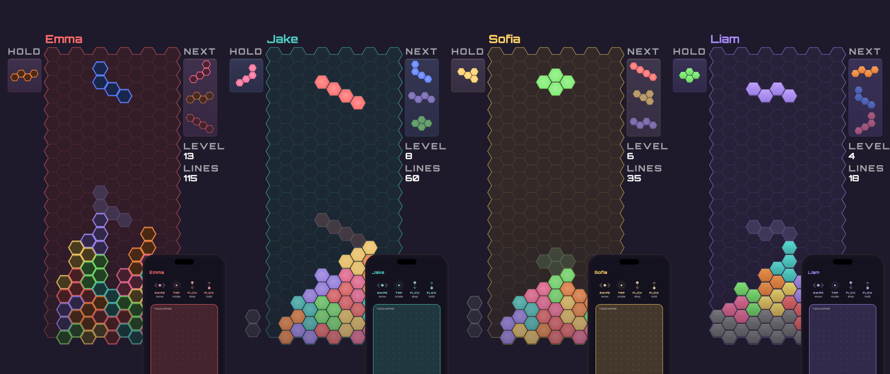
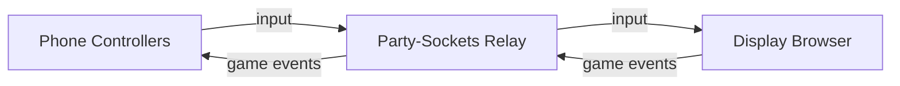

# HexStacker Party



Browser-based multiplayer hex stacker where phones become controllers and a shared screen shows the action.

**Play now at [hexstackerparty.com](https://hexstackerparty.com)**

## Overview

HexStacker Party supports 1 to 8 players on a single shared display. One browser window acts as the game screen (TV, monitor, or laptop), while each player joins by scanning a QR code with their phone. The phone becomes a touch-based controller with gesture input and haptic feedback. The display client runs the authoritative game engine, communicating with controllers through a lightweight WebSocket relay.

## Architecture



The display browser runs the game engine and renders all player boards. Controllers send input through a [Party-Sockets](https://github.com/tim4724/Party-Sockets) WebSocket relay. The Node.js server only serves static files and a QR code API.

## Features

- 1–8 players on one screen
- QR code join – scan and play, no app install
- Touch gesture controls with haptic feedback
- Flat-top hexagonal grid with dual-zigzag line clears
- Competitive mode with garbage lines
- Rotation with wall kicks
- 8-bag randomizer (I, O, S, Z, q, p, L, J)
- Localized UI (11 languages)
- AirConsole platform support (`screen.html` / `controller.html`)

## Quick Start

```bash
npm install
node server/index.js
```

1. Open `http://localhost:4000` on a big screen.
2. Players scan the QR code with their phones to join.
3. The first player to join is the host and starts the game.
4. Use touch gestures on your phone to control pieces. Last player standing wins.

## Controller Gestures

| Gesture | Action |
|---|---|
| Drag left/right | Move piece horizontally (ratcheting at 44 px steps) |
| Tap | Rotate clockwise |
| Flick down | Hard drop |
| Drag down + hold | Soft drop (variable speed based on drag distance) |
| Flick up | Hold piece |

All gestures provide haptic feedback on supported devices. The controller uses axis locking so horizontal and vertical movements do not interfere with each other.

## Project Structure

```
server/      # Game engine modules (isomorphic UMD, used by display + tests)
public/
  display/   # Display client: game authority, Canvas renderer
  controller/# Phone touch controller
  shared/    # Protocol, relay connection, colors, theme, shared UI
scripts/     # Build and code-generation scripts (AirConsole HTML generator)
tests/       # Unit tests (node:test) and Playwright visual snapshots
artwork/     # Banner, favicon, and cover art generators (Playwright)
```

## Configuration

The display and controllers connect to a [Party-Sockets](https://github.com/tim4724/Party-Sockets) WebSocket relay for message forwarding. The relay URL is set in `public/shared/protocol.js`. If you run your own relay, update this value and the CSP `connect-src` directive in `server/index.js`.

| Environment Variable | Default | Description |
|---|---|---|
| `PORT` | `4000` | HTTP server port |
| `BASE_URL` | Auto-detected LAN IP | Base URL for join links and QR codes |
| `APP_ENV` | `development` | Set to `production` for production mode |
| `GIT_SHA` | – | Git commit SHA shown in version endpoint |

## Testing

```bash
# Unit tests
npm test

# E2E lifecycle tests
npm run test:e2e

# AirConsole E2E tests
npm run test:e2e:airconsole

# Visual snapshot tests
npm run test:visual

# Update visual snapshots after intentional UI changes
npm run test:visual:update
```

Unit tests use Node.js's built-in `node:test` runner with `node:assert/strict` — no test framework dependency. E2E and visual tests use Playwright against a live server on port 4100.

## Tech Stack

- **Runtime**: Node.js
- **Relay**: [Party-Sockets](https://github.com/tim4724/Party-Sockets) WebSocket relay
- **QR codes**: [qrcode](https://github.com/soldair/node-qrcode)
- **Frontend**: Vanilla JavaScript, Canvas API
- **Testing**: Node.js built-in test runner + Playwright
- **Production deps**: 1 npm package (`qrcode`)

No build step. No bundler. No framework. Serve and play.
