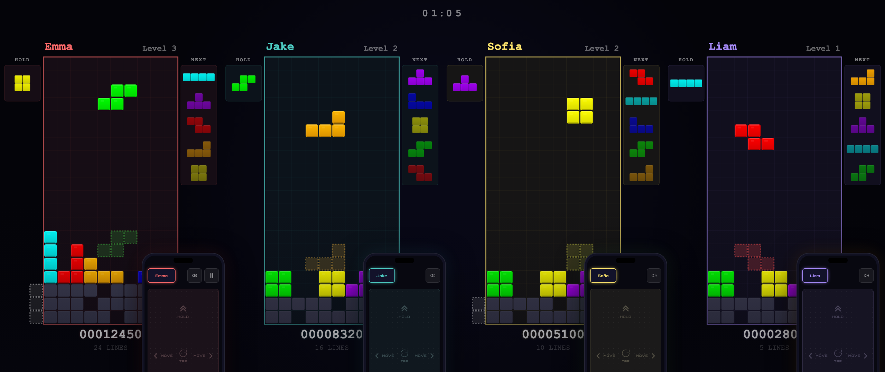
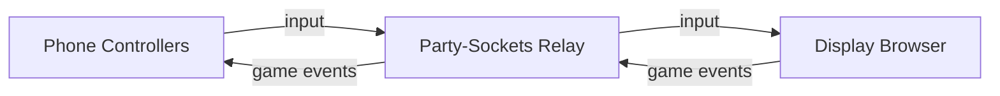

# Tetris Party



Browser-based multiplayer Tetris where phones become controllers and a shared screen shows the action.

**Play now at [tetris.party](https://tetris.party)**

## Overview

Tetris Party supports 1 to 4 players on a single shared display. One browser window acts as the game screen (TV, monitor, or laptop), while each player joins by scanning a QR code with their phone. The phone becomes a touch-based controller with gesture input and haptic feedback. The display client runs the authoritative game engine at 60 Hz, communicating with controllers through a lightweight WebSocket relay.

## Architecture



The display browser runs the game engine and renders all player boards. Controllers send input through a [Party-Sockets](https://github.com/tim4724/Party-Sockets) WebSocket relay. The Node.js server only serves static files and a QR code API. Since the display client is the game authority, there is no server-side validation of game outcomes -- this is an accepted trade-off for a local party game.

## Features

- 1--4 players on one screen
- QR code join -- scan and play, no app install
- Touch gesture controls with haptic feedback
- Competitive mode with garbage lines
- SRS rotation with wall kicks and T-spin detection
- 7-bag randomizer, back-to-back bonus scoring

## Quick Start

```bash
npm install
node server/index.js
```

1. Open `http://localhost:4000` on a big screen (TV, monitor, or projector).
2. Scan the QR code shown on the display with your phone.
3. Once players have joined, the host starts the game from their phone.

## How to Play

1. **Set up the display.** Open the display URL in a browser on a large screen visible to all players.
2. **Join the game.** Each player scans the QR code with their phone. The phone browser opens a controller page automatically.
3. **Start.** The first player to join is the host. The host starts the match from their phone. A 3-second countdown begins.
4. **Play.** Use touch gestures on your phone to control your falling pieces. Your board is shown on the shared display alongside other players.
5. **Win.** The last player standing wins.

## Controller Gestures

| Gesture | Action |
|---|---|
| Drag left/right | Move piece horizontally (ratcheting at 44 px steps) |
| Tap | Rotate clockwise |
| Flick down | Hard drop |
| Drag down + hold | Soft drop (variable speed based on drag distance) |
| Flick up | Hold piece |

All gestures provide haptic feedback on supported devices. The controller uses axis locking so horizontal and vertical movements do not interfere with each other.

## Project Structure

```
server/      # Game engine modules (isomorphic UMD, used by display + tests)
public/
  display/   # Display client: game authority, Canvas renderer
  controller/# Phone touch controller
  shared/    # Protocol, relay connection, colors, theme, shared UI
tests/       # Unit tests (node:test) and Playwright visual snapshots
```

## Configuration

The display and controllers connect to a WebSocket relay (Party-Server) for message forwarding at `wss://ws.tetris.party`.

## Testing

```bash
# Unit tests
npm test

# Visual snapshot tests
npm run test:visual

# Update visual snapshots after intentional UI changes
npm run test:visual:update
```

Unit tests use Node.js's built-in `node:test` runner with `node:assert/strict` — no test framework dependency. Visual tests use Playwright against a live server on port 4100.

## Docker

```bash
docker compose up
```

The app is available at `http://localhost:4000`. Production is at [tetris.party](https://tetris.party).

## Tech Stack

- **Runtime**: Node.js
- **Relay**: [Party-Sockets](https://github.com/tim4724/Party-Sockets) WebSocket relay
- **QR codes**: [qrcode](https://github.com/soldair/node-qrcode)
- **Frontend**: Vanilla JavaScript, Canvas API
- **Testing**: Node.js built-in test runner + Playwright
- **Production deps**: 1 npm package (`qrcode`)

No build step. No bundler. No framework. Serve and play.
